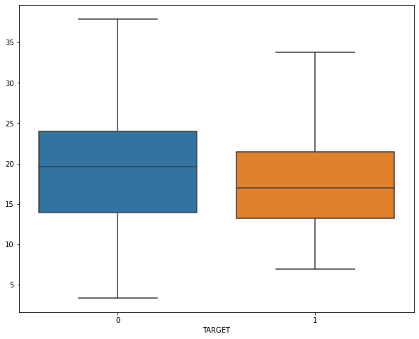
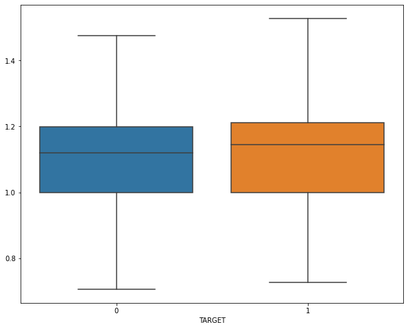
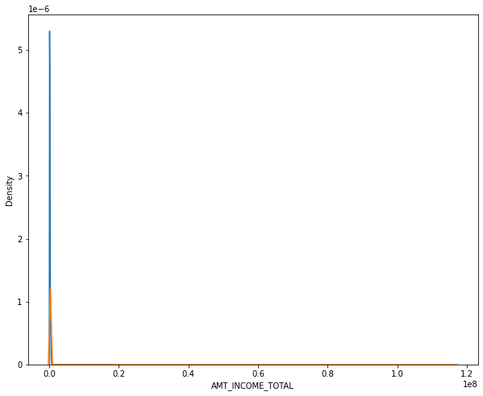
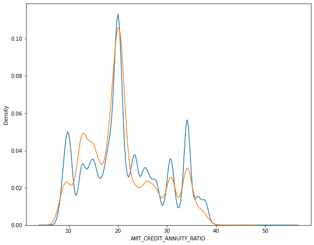
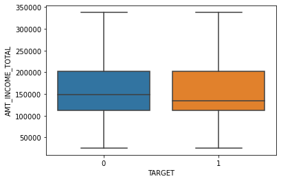
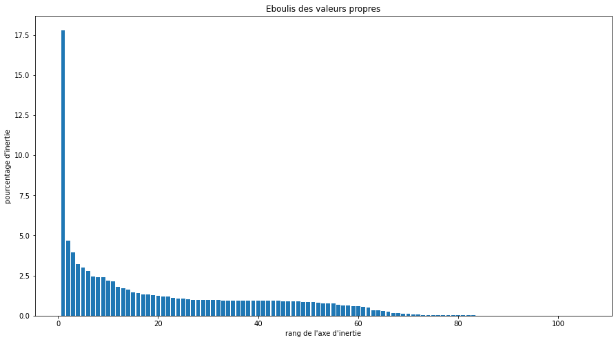
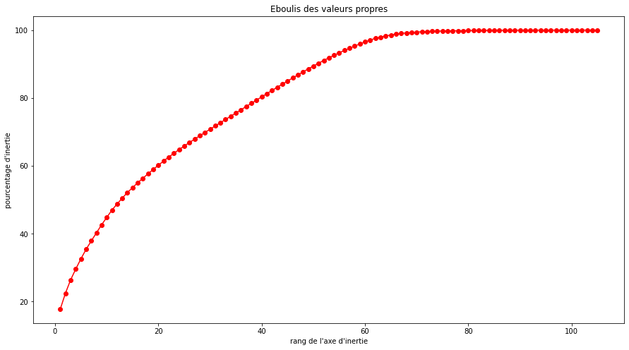

## Data Analyze

In this notebook we are going to try to understand everything about the data.

We do not hesitate to go back to data prep to make some changes and clean more external data.

We are going to use that exploration technques to dig in the data and find hopefully some insights.


**There are 7 different sources of data**:

- **application_train/application_test**: the main training and testing data with information about each loan application at Home Credit. Every loan has its own row and is identified by the feature SK_ID_CURR. The training application data comes with the TARGET indicating 0: the loan was repaid or 1: the loan was not repaid.
- **bureau**: data concerning client's previous credits from other financial institutions. Each previous credit has its own row in bureau, but one loan in the application data can have multiple previous credits.
- **bureau_balance**: monthly data about the previous credits in bureau. Each row is one month of a previous credit, and a single previous credit can have multiple rows, one for each month of the credit length.
- **previous_application**: previous applications for loans at Home Credit of clients who have loans in the application data. Each current loan in the application data can have multiple previous loans. Each previous application has one row and is identified by the feature SK_ID_PREV.
- **POS_CASH_BALANCE**: monthly data about previous point of sale or cash loans clients have had with Home Credit. Each row is one month of a previous point of sale or cash loan, and a single previous loan can have many rows.
- **credit_card_balance**: monthly data about previous credit cards clients have had with Home Credit. Each row is one month of a credit card balance, and a single credit card can have many rows.
- **installments_payment**: payment history for previous loans at Home Credit. There is one row for every made payment and one row for every missed payment.


```python
# correlations :: for very variable list five or ten most correlated other vars and that for quanti data

#### for quali do some frequency tables and corss them across many other quali variables

# graphs

# 
```


```python
%ls data/
```

    HomeCredit_columns_description.csv  bureau.csv
    POS_CASH_balance.csv                bureau_balance.csv
    app_test.csv                        credit_card_balance.csv
    app_train.csv                       installments_payments.csv
    app_train_clean.csv                 previous_application.csv
    application_test.csv                sample_submission.csv
    application_train.csv               y_app_train.csv


```python
# numpy and pandas for data manipulation
import numpy as np
import pandas as pd 


# pandas display settings 
pd.set_option('display.max_columns',None)
pd.set_option('display.max_rows', None)

# sklearn preprocessing for dealing with categorical variables
from sklearn.preprocessing import LabelEncoder

# File system manangement
import os

# Suppress warnings 
import warnings
warnings.filterwarnings('ignore')

# matplotlib and seaborn for plotting
import matplotlib.pyplot as plt
import seaborn as sns
```


```python
from utils import utils_prep as prep
```


```python
app_train=prep.readCsvFileFromDir("data/",'app_train_clean.csv')
```


```python
app_train['SK_ID_CURR']=app_train.key_0
app_train.drop(columns=['key_0','Unnamed: 0'], inplace=True)
app_train.set_index('SK_ID_CURR', inplace=True)
```


```python
app_train.head()
```


<div>
<style scoped>
    .dataframe tbody tr th:only-of-type {
        vertical-align: middle;
    }

    .dataframe tbody tr th {
        vertical-align: top;
    }

    .dataframe thead th {
        text-align: right;
    }
</style>
<table border="1" class="dataframe">
  <thead>
    <tr style="text-align: right;">
      <th></th>
      <th>TARGET</th>
      <th>CNT_CHILDREN</th>
      <th>AMT_INCOME_TOTAL</th>
      <th>AMT_CREDIT</th>
      <th>AMT_ANNUITY</th>
      <th>AMT_GOODS_PRICE</th>
      <th>REGION_POPULATION_RELATIVE</th>
      <th>DAYS_BIRTH</th>
      <th>DAYS_EMPLOYED</th>
      <th>DAYS_REGISTRATION</th>
      <th>DAYS_ID_PUBLISH</th>
      <th>OWN_CAR_AGE</th>
      <th>FLAG_MOBIL</th>
      <th>FLAG_EMP_PHONE</th>
      <th>FLAG_WORK_PHONE</th>
      <th>FLAG_CONT_MOBILE</th>
      <th>FLAG_PHONE</th>
      <th>FLAG_EMAIL</th>
      <th>CNT_FAM_MEMBERS</th>
      <th>REGION_RATING_CLIENT</th>
      <th>REGION_RATING_CLIENT_W_CITY</th>
      <th>HOUR_APPR_PROCESS_START</th>
      <th>REG_REGION_NOT_LIVE_REGION</th>
      <th>REG_REGION_NOT_WORK_REGION</th>
      <th>LIVE_REGION_NOT_WORK_REGION</th>
      <th>REG_CITY_NOT_LIVE_CITY</th>
      <th>REG_CITY_NOT_WORK_CITY</th>
      <th>LIVE_CITY_NOT_WORK_CITY</th>
      <th>EXT_SOURCE_1</th>
      <th>EXT_SOURCE_2</th>
      <th>EXT_SOURCE_3</th>
      <th>APARTMENTS_AVG</th>
      <th>BASEMENTAREA_AVG</th>
      <th>YEARS_BEGINEXPLUATATION_AVG</th>
      <th>YEARS_BUILD_AVG</th>
      <th>COMMONAREA_AVG</th>
      <th>ELEVATORS_AVG</th>
      <th>ENTRANCES_AVG</th>
      <th>FLOORSMAX_AVG</th>
      <th>FLOORSMIN_AVG</th>
      <th>LANDAREA_AVG</th>
      <th>LIVINGAPARTMENTS_AVG</th>
      <th>LIVINGAREA_AVG</th>
      <th>NONLIVINGAPARTMENTS_AVG</th>
      <th>NONLIVINGAREA_AVG</th>
      <th>APARTMENTS_MODE</th>
      <th>BASEMENTAREA_MODE</th>
      <th>YEARS_BEGINEXPLUATATION_MODE</th>
      <th>YEARS_BUILD_MODE</th>
      <th>COMMONAREA_MODE</th>
      <th>ELEVATORS_MODE</th>
      <th>ENTRANCES_MODE</th>
      <th>FLOORSMAX_MODE</th>
      <th>FLOORSMIN_MODE</th>
      <th>LANDAREA_MODE</th>
      <th>LIVINGAPARTMENTS_MODE</th>
      <th>LIVINGAREA_MODE</th>
      <th>NONLIVINGAPARTMENTS_MODE</th>
      <th>NONLIVINGAREA_MODE</th>
      <th>APARTMENTS_MEDI</th>
      <th>BASEMENTAREA_MEDI</th>
      <th>YEARS_BEGINEXPLUATATION_MEDI</th>
      <th>YEARS_BUILD_MEDI</th>
      <th>COMMONAREA_MEDI</th>
      <th>ELEVATORS_MEDI</th>
      <th>ENTRANCES_MEDI</th>
      <th>FLOORSMAX_MEDI</th>
      <th>FLOORSMIN_MEDI</th>
      <th>LANDAREA_MEDI</th>
      <th>LIVINGAPARTMENTS_MEDI</th>
      <th>LIVINGAREA_MEDI</th>
      <th>NONLIVINGAPARTMENTS_MEDI</th>
      <th>NONLIVINGAREA_MEDI</th>
      <th>TOTALAREA_MODE</th>
      <th>OBS_30_CNT_SOCIAL_CIRCLE</th>
      <th>DEF_30_CNT_SOCIAL_CIRCLE</th>
      <th>OBS_60_CNT_SOCIAL_CIRCLE</th>
      <th>DEF_60_CNT_SOCIAL_CIRCLE</th>
      <th>DAYS_LAST_PHONE_CHANGE</th>
      <th>FLAG_DOCUMENT_2</th>
      <th>FLAG_DOCUMENT_3</th>
      <th>FLAG_DOCUMENT_4</th>
      <th>FLAG_DOCUMENT_5</th>
      <th>FLAG_DOCUMENT_6</th>
      <th>FLAG_DOCUMENT_7</th>
      <th>FLAG_DOCUMENT_8</th>
      <th>FLAG_DOCUMENT_9</th>
      <th>FLAG_DOCUMENT_10</th>
      <th>FLAG_DOCUMENT_11</th>
      <th>FLAG_DOCUMENT_12</th>
      <th>FLAG_DOCUMENT_13</th>
      <th>FLAG_DOCUMENT_14</th>
      <th>FLAG_DOCUMENT_15</th>
      <th>FLAG_DOCUMENT_16</th>
      <th>FLAG_DOCUMENT_17</th>
      <th>FLAG_DOCUMENT_18</th>
      <th>FLAG_DOCUMENT_19</th>
      <th>FLAG_DOCUMENT_20</th>
      <th>FLAG_DOCUMENT_21</th>
      <th>AMT_REQ_CREDIT_BUREAU_HOUR</th>
      <th>AMT_REQ_CREDIT_BUREAU_DAY</th>
      <th>AMT_REQ_CREDIT_BUREAU_WEEK</th>
      <th>AMT_REQ_CREDIT_BUREAU_MON</th>
      <th>AMT_REQ_CREDIT_BUREAU_QRT</th>
      <th>AMT_REQ_CREDIT_BUREAU_YEAR</th>
      <th>NAME_CONTRACT_TYPE</th>
      <th>CODE_GENDER</th>
      <th>FLAG_OWN_CAR</th>
      <th>FLAG_OWN_REALTY</th>
      <th>NAME_TYPE_SUITE</th>
      <th>NAME_INCOME_TYPE</th>
      <th>NAME_EDUCATION_TYPE</th>
      <th>NAME_FAMILY_STATUS</th>
      <th>NAME_HOUSING_TYPE</th>
      <th>OCCUPATION_TYPE</th>
      <th>WEEKDAY_APPR_PROCESS_START</th>
      <th>ORGANIZATION_TYPE</th>
      <th>FONDKAPREMONT_MODE</th>
      <th>HOUSETYPE_MODE</th>
      <th>WALLSMATERIAL_MODE</th>
      <th>EMERGENCYSTATE_MODE</th>
    </tr>
    <tr>
      <th>SK_ID_CURR</th>
      <th></th>
      <th></th>
      <th></th>
      <th></th>
      <th></th>
      <th></th>
      <th></th>
      <th></th>
      <th></th>
      <th></th>
      <th></th>
      <th></th>
      <th></th>
      <th></th>
      <th></th>
      <th></th>
      <th></th>
      <th></th>
      <th></th>
      <th></th>
      <th></th>
      <th></th>
      <th></th>
      <th></th>
      <th></th>
      <th></th>
      <th></th>
      <th></th>
      <th></th>
      <th></th>
      <th></th>
      <th></th>
      <th></th>
      <th></th>
      <th></th>
      <th></th>
      <th></th>
      <th></th>
      <th></th>
      <th></th>
      <th></th>
      <th></th>
      <th></th>
      <th></th>
      <th></th>
      <th></th>
      <th></th>
      <th></th>
      <th></th>
      <th></th>
      <th></th>
      <th></th>
      <th></th>
      <th></th>
      <th></th>
      <th></th>
      <th></th>
      <th></th>
      <th></th>
      <th></th>
      <th></th>
      <th></th>
      <th></th>
      <th></th>
      <th></th>
      <th></th>
      <th></th>
      <th></th>
      <th></th>
      <th></th>
      <th></th>
      <th></th>
      <th></th>
      <th></th>
      <th></th>
      <th></th>
      <th></th>
      <th></th>
      <th></th>
      <th></th>
      <th></th>
      <th></th>
      <th></th>
      <th></th>
      <th></th>
      <th></th>
      <th></th>
      <th></th>
      <th></th>
      <th></th>
      <th></th>
      <th></th>
      <th></th>
      <th></th>
      <th></th>
      <th></th>
      <th></th>
      <th></th>
      <th></th>
      <th></th>
      <th></th>
      <th></th>
      <th></th>
      <th></th>
      <th></th>
      <th></th>
      <th></th>
      <th></th>
      <th></th>
      <th></th>
      <th></th>
      <th></th>
      <th></th>
      <th></th>
      <th></th>
      <th></th>
      <th></th>
      <th></th>
      <th></th>
      <th></th>
      <th></th>
    </tr>
  </thead>
  <tbody>
    <tr>
      <th>100002</th>
      <td>1</td>
      <td>0</td>
      <td>202500.0</td>
      <td>406597.5</td>
      <td>24700.5</td>
      <td>351000.0</td>
      <td>0.018801</td>
      <td>-9461</td>
      <td>-637</td>
      <td>-3648.0</td>
      <td>-2120</td>
      <td>12.061091</td>
      <td>1</td>
      <td>1</td>
      <td>0</td>
      <td>1</td>
      <td>1</td>
      <td>0</td>
      <td>1.0</td>
      <td>2</td>
      <td>2</td>
      <td>10</td>
      <td>0</td>
      <td>0</td>
      <td>0</td>
      <td>0</td>
      <td>0</td>
      <td>0</td>
      <td>0.083037</td>
      <td>0.262949</td>
      <td>0.139376</td>
      <td>0.02470</td>
      <td>0.036900</td>
      <td>0.972200</td>
      <td>0.619200</td>
      <td>0.014300</td>
      <td>0.000000</td>
      <td>0.069000</td>
      <td>0.083300</td>
      <td>0.125000</td>
      <td>0.036900</td>
      <td>0.020200</td>
      <td>0.019000</td>
      <td>0.000000</td>
      <td>0.000000</td>
      <td>0.025200</td>
      <td>0.038300</td>
      <td>0.972200</td>
      <td>0.634100</td>
      <td>0.014400</td>
      <td>0.00000</td>
      <td>0.069000</td>
      <td>0.083300</td>
      <td>0.125000</td>
      <td>0.037700</td>
      <td>0.022000</td>
      <td>0.019800</td>
      <td>0.000000</td>
      <td>0.000000</td>
      <td>0.02500</td>
      <td>0.036900</td>
      <td>0.972200</td>
      <td>0.624300</td>
      <td>0.014400</td>
      <td>0.000000</td>
      <td>0.069000</td>
      <td>0.083300</td>
      <td>0.125000</td>
      <td>0.037500</td>
      <td>0.020500</td>
      <td>0.019300</td>
      <td>0.000000</td>
      <td>0.000000</td>
      <td>0.014900</td>
      <td>2.0</td>
      <td>2.0</td>
      <td>2.0</td>
      <td>2.0</td>
      <td>-1134.0</td>
      <td>0</td>
      <td>1</td>
      <td>0</td>
      <td>0</td>
      <td>0</td>
      <td>0</td>
      <td>0</td>
      <td>0</td>
      <td>0</td>
      <td>0</td>
      <td>0</td>
      <td>0</td>
      <td>0</td>
      <td>0</td>
      <td>0</td>
      <td>0</td>
      <td>0</td>
      <td>0</td>
      <td>0</td>
      <td>0</td>
      <td>0.000000</td>
      <td>0.000</td>
      <td>0.000000</td>
      <td>0.000000</td>
      <td>0.000000</td>
      <td>1.000000</td>
      <td>Cash loans</td>
      <td>M</td>
      <td>N</td>
      <td>Y</td>
      <td>Unaccompanied</td>
      <td>Working</td>
      <td>Secondary / secondary special</td>
      <td>Single / not married</td>
      <td>House / apartment</td>
      <td>Laborers</td>
      <td>WEDNESDAY</td>
      <td>Business Entity Type 3</td>
      <td>reg oper account</td>
      <td>block of flats</td>
      <td>Stone, brick</td>
      <td>No</td>
    </tr>
    <tr>
      <th>100003</th>
      <td>0</td>
      <td>0</td>
      <td>270000.0</td>
      <td>1293502.5</td>
      <td>35698.5</td>
      <td>1129500.0</td>
      <td>0.003541</td>
      <td>-16765</td>
      <td>-1188</td>
      <td>-1186.0</td>
      <td>-291</td>
      <td>12.061091</td>
      <td>1</td>
      <td>1</td>
      <td>0</td>
      <td>1</td>
      <td>1</td>
      <td>0</td>
      <td>2.0</td>
      <td>1</td>
      <td>1</td>
      <td>11</td>
      <td>0</td>
      <td>0</td>
      <td>0</td>
      <td>0</td>
      <td>0</td>
      <td>0</td>
      <td>0.311267</td>
      <td>0.622246</td>
      <td>0.510853</td>
      <td>0.09590</td>
      <td>0.052900</td>
      <td>0.985100</td>
      <td>0.796000</td>
      <td>0.060500</td>
      <td>0.080000</td>
      <td>0.034500</td>
      <td>0.291700</td>
      <td>0.333300</td>
      <td>0.013000</td>
      <td>0.077300</td>
      <td>0.054900</td>
      <td>0.003900</td>
      <td>0.009800</td>
      <td>0.092400</td>
      <td>0.053800</td>
      <td>0.985100</td>
      <td>0.804000</td>
      <td>0.049700</td>
      <td>0.08060</td>
      <td>0.034500</td>
      <td>0.291700</td>
      <td>0.333300</td>
      <td>0.012800</td>
      <td>0.079000</td>
      <td>0.055400</td>
      <td>0.000000</td>
      <td>0.000000</td>
      <td>0.09680</td>
      <td>0.052900</td>
      <td>0.985100</td>
      <td>0.798700</td>
      <td>0.060800</td>
      <td>0.080000</td>
      <td>0.034500</td>
      <td>0.291700</td>
      <td>0.333300</td>
      <td>0.013200</td>
      <td>0.078700</td>
      <td>0.055800</td>
      <td>0.003900</td>
      <td>0.010000</td>
      <td>0.071400</td>
      <td>1.0</td>
      <td>0.0</td>
      <td>1.0</td>
      <td>0.0</td>
      <td>-828.0</td>
      <td>0</td>
      <td>1</td>
      <td>0</td>
      <td>0</td>
      <td>0</td>
      <td>0</td>
      <td>0</td>
      <td>0</td>
      <td>0</td>
      <td>0</td>
      <td>0</td>
      <td>0</td>
      <td>0</td>
      <td>0</td>
      <td>0</td>
      <td>0</td>
      <td>0</td>
      <td>0</td>
      <td>0</td>
      <td>0</td>
      <td>0.000000</td>
      <td>0.000</td>
      <td>0.000000</td>
      <td>0.000000</td>
      <td>0.000000</td>
      <td>0.000000</td>
      <td>Cash loans</td>
      <td>F</td>
      <td>N</td>
      <td>N</td>
      <td>Family</td>
      <td>State servant</td>
      <td>Higher education</td>
      <td>Married</td>
      <td>House / apartment</td>
      <td>Core staff</td>
      <td>MONDAY</td>
      <td>School</td>
      <td>reg oper account</td>
      <td>block of flats</td>
      <td>Block</td>
      <td>No</td>
    </tr>
    <tr>
      <th>100004</th>
      <td>0</td>
      <td>0</td>
      <td>67500.0</td>
      <td>135000.0</td>
      <td>6750.0</td>
      <td>135000.0</td>
      <td>0.010032</td>
      <td>-19046</td>
      <td>-225</td>
      <td>-4260.0</td>
      <td>-2531</td>
      <td>26.000000</td>
      <td>1</td>
      <td>1</td>
      <td>1</td>
      <td>1</td>
      <td>1</td>
      <td>0</td>
      <td>1.0</td>
      <td>2</td>
      <td>2</td>
      <td>9</td>
      <td>0</td>
      <td>0</td>
      <td>0</td>
      <td>0</td>
      <td>0</td>
      <td>0</td>
      <td>0.502130</td>
      <td>0.555912</td>
      <td>0.729567</td>
      <td>0.11744</td>
      <td>0.088442</td>
      <td>0.977735</td>
      <td>0.752471</td>
      <td>0.044621</td>
      <td>0.078942</td>
      <td>0.149725</td>
      <td>0.226282</td>
      <td>0.231894</td>
      <td>0.066333</td>
      <td>0.100775</td>
      <td>0.107399</td>
      <td>0.008809</td>
      <td>0.028358</td>
      <td>0.114231</td>
      <td>0.087543</td>
      <td>0.977065</td>
      <td>0.759637</td>
      <td>0.042553</td>
      <td>0.07449</td>
      <td>0.145193</td>
      <td>0.222315</td>
      <td>0.228058</td>
      <td>0.064958</td>
      <td>0.105645</td>
      <td>0.105975</td>
      <td>0.008076</td>
      <td>0.027022</td>
      <td>0.11785</td>
      <td>0.087955</td>
      <td>0.977752</td>
      <td>0.755746</td>
      <td>0.044595</td>
      <td>0.078078</td>
      <td>0.149213</td>
      <td>0.225897</td>
      <td>0.231625</td>
      <td>0.067169</td>
      <td>0.101954</td>
      <td>0.108607</td>
      <td>0.008651</td>
      <td>0.028236</td>
      <td>0.102547</td>
      <td>0.0</td>
      <td>0.0</td>
      <td>0.0</td>
      <td>0.0</td>
      <td>-815.0</td>
      <td>0</td>
      <td>0</td>
      <td>0</td>
      <td>0</td>
      <td>0</td>
      <td>0</td>
      <td>0</td>
      <td>0</td>
      <td>0</td>
      <td>0</td>
      <td>0</td>
      <td>0</td>
      <td>0</td>
      <td>0</td>
      <td>0</td>
      <td>0</td>
      <td>0</td>
      <td>0</td>
      <td>0</td>
      <td>0</td>
      <td>0.000000</td>
      <td>0.000</td>
      <td>0.000000</td>
      <td>0.000000</td>
      <td>0.000000</td>
      <td>0.000000</td>
      <td>Revolving loans</td>
      <td>M</td>
      <td>Y</td>
      <td>Y</td>
      <td>Unaccompanied</td>
      <td>Working</td>
      <td>Secondary / secondary special</td>
      <td>Single / not married</td>
      <td>House / apartment</td>
      <td>Laborers</td>
      <td>MONDAY</td>
      <td>Government</td>
      <td>Unknown</td>
      <td>Unknown</td>
      <td>Unknown</td>
      <td>Unknown</td>
    </tr>
    <tr>
      <th>100006</th>
      <td>0</td>
      <td>0</td>
      <td>135000.0</td>
      <td>312682.5</td>
      <td>29686.5</td>
      <td>297000.0</td>
      <td>0.008019</td>
      <td>-19005</td>
      <td>-3039</td>
      <td>-9833.0</td>
      <td>-2437</td>
      <td>12.061091</td>
      <td>1</td>
      <td>1</td>
      <td>0</td>
      <td>1</td>
      <td>0</td>
      <td>0</td>
      <td>2.0</td>
      <td>2</td>
      <td>2</td>
      <td>17</td>
      <td>0</td>
      <td>0</td>
      <td>0</td>
      <td>0</td>
      <td>0</td>
      <td>0</td>
      <td>0.502130</td>
      <td>0.650442</td>
      <td>0.510853</td>
      <td>0.11744</td>
      <td>0.088442</td>
      <td>0.977735</td>
      <td>0.752471</td>
      <td>0.044621</td>
      <td>0.078942</td>
      <td>0.149725</td>
      <td>0.226282</td>
      <td>0.231894</td>
      <td>0.066333</td>
      <td>0.100775</td>
      <td>0.107399</td>
      <td>0.008809</td>
      <td>0.028358</td>
      <td>0.114231</td>
      <td>0.087543</td>
      <td>0.977065</td>
      <td>0.759637</td>
      <td>0.042553</td>
      <td>0.07449</td>
      <td>0.145193</td>
      <td>0.222315</td>
      <td>0.228058</td>
      <td>0.064958</td>
      <td>0.105645</td>
      <td>0.105975</td>
      <td>0.008076</td>
      <td>0.027022</td>
      <td>0.11785</td>
      <td>0.087955</td>
      <td>0.977752</td>
      <td>0.755746</td>
      <td>0.044595</td>
      <td>0.078078</td>
      <td>0.149213</td>
      <td>0.225897</td>
      <td>0.231625</td>
      <td>0.067169</td>
      <td>0.101954</td>
      <td>0.108607</td>
      <td>0.008651</td>
      <td>0.028236</td>
      <td>0.102547</td>
      <td>2.0</td>
      <td>0.0</td>
      <td>2.0</td>
      <td>0.0</td>
      <td>-617.0</td>
      <td>0</td>
      <td>1</td>
      <td>0</td>
      <td>0</td>
      <td>0</td>
      <td>0</td>
      <td>0</td>
      <td>0</td>
      <td>0</td>
      <td>0</td>
      <td>0</td>
      <td>0</td>
      <td>0</td>
      <td>0</td>
      <td>0</td>
      <td>0</td>
      <td>0</td>
      <td>0</td>
      <td>0</td>
      <td>0</td>
      <td>0.006402</td>
      <td>0.007</td>
      <td>0.034362</td>
      <td>0.267395</td>
      <td>0.265474</td>
      <td>1.899974</td>
      <td>Cash loans</td>
      <td>F</td>
      <td>N</td>
      <td>Y</td>
      <td>Unaccompanied</td>
      <td>Working</td>
      <td>Secondary / secondary special</td>
      <td>Civil marriage</td>
      <td>House / apartment</td>
      <td>Laborers</td>
      <td>WEDNESDAY</td>
      <td>Business Entity Type 3</td>
      <td>Unknown</td>
      <td>Unknown</td>
      <td>Unknown</td>
      <td>Unknown</td>
    </tr>
    <tr>
      <th>100007</th>
      <td>0</td>
      <td>0</td>
      <td>121500.0</td>
      <td>513000.0</td>
      <td>21865.5</td>
      <td>513000.0</td>
      <td>0.028663</td>
      <td>-19932</td>
      <td>-3038</td>
      <td>-4311.0</td>
      <td>-3458</td>
      <td>12.061091</td>
      <td>1</td>
      <td>1</td>
      <td>0</td>
      <td>1</td>
      <td>0</td>
      <td>0</td>
      <td>1.0</td>
      <td>2</td>
      <td>2</td>
      <td>11</td>
      <td>0</td>
      <td>0</td>
      <td>0</td>
      <td>0</td>
      <td>1</td>
      <td>1</td>
      <td>0.502130</td>
      <td>0.322738</td>
      <td>0.510853</td>
      <td>0.11744</td>
      <td>0.088442</td>
      <td>0.977735</td>
      <td>0.752471</td>
      <td>0.044621</td>
      <td>0.078942</td>
      <td>0.149725</td>
      <td>0.226282</td>
      <td>0.231894</td>
      <td>0.066333</td>
      <td>0.100775</td>
      <td>0.107399</td>
      <td>0.008809</td>
      <td>0.028358</td>
      <td>0.114231</td>
      <td>0.087543</td>
      <td>0.977065</td>
      <td>0.759637</td>
      <td>0.042553</td>
      <td>0.07449</td>
      <td>0.145193</td>
      <td>0.222315</td>
      <td>0.228058</td>
      <td>0.064958</td>
      <td>0.105645</td>
      <td>0.105975</td>
      <td>0.008076</td>
      <td>0.027022</td>
      <td>0.11785</td>
      <td>0.087955</td>
      <td>0.977752</td>
      <td>0.755746</td>
      <td>0.044595</td>
      <td>0.078078</td>
      <td>0.149213</td>
      <td>0.225897</td>
      <td>0.231625</td>
      <td>0.067169</td>
      <td>0.101954</td>
      <td>0.108607</td>
      <td>0.008651</td>
      <td>0.028236</td>
      <td>0.102547</td>
      <td>0.0</td>
      <td>0.0</td>
      <td>0.0</td>
      <td>0.0</td>
      <td>-1106.0</td>
      <td>0</td>
      <td>0</td>
      <td>0</td>
      <td>0</td>
      <td>0</td>
      <td>0</td>
      <td>1</td>
      <td>0</td>
      <td>0</td>
      <td>0</td>
      <td>0</td>
      <td>0</td>
      <td>0</td>
      <td>0</td>
      <td>0</td>
      <td>0</td>
      <td>0</td>
      <td>0</td>
      <td>0</td>
      <td>0</td>
      <td>0.000000</td>
      <td>0.000</td>
      <td>0.000000</td>
      <td>0.000000</td>
      <td>0.000000</td>
      <td>0.000000</td>
      <td>Cash loans</td>
      <td>M</td>
      <td>N</td>
      <td>Y</td>
      <td>Unaccompanied</td>
      <td>Working</td>
      <td>Secondary / secondary special</td>
      <td>Single / not married</td>
      <td>House / apartment</td>
      <td>Core staff</td>
      <td>THURSDAY</td>
      <td>Religion</td>
      <td>Unknown</td>
      <td>Unknown</td>
      <td>Unknown</td>
      <td>Unknown</td>
    </tr>
  </tbody>
</table>
</div>


```python
prep.firstStats(app_train)
```


<div>
<style scoped>
    .dataframe tbody tr th:only-of-type {
        vertical-align: middle;
    }

    .dataframe tbody tr th {
        vertical-align: top;
    }

    .dataframe thead th {
        text-align: right;
    }
</style>
<table border="1" class="dataframe">
  <thead>
    <tr style="text-align: right;">
      <th></th>
      <th>stats</th>
    </tr>
  </thead>
  <tbody>
    <tr>
      <th>nbRows</th>
      <td>307511</td>
    </tr>
    <tr>
      <th>nbColumns</th>
      <td>121</td>
    </tr>
    <tr>
      <th>float64</th>
      <td>65</td>
    </tr>
    <tr>
      <th>int64</th>
      <td>40</td>
    </tr>
    <tr>
      <th>object</th>
      <td>16</td>
    </tr>
  </tbody>
</table>
</div>


```python
# How statistics can help us to understand the data?
#(Always ask question, this is the way to dig in data)
# visualization, okay
# To see variable dispersion among their means...
# correlation, okay

# What is the problem here?
# The Home Creadit Risk Project is to analyze a data for building a model that helps to say if with respect to some 
#characteristics of a person, if we can give him a loan or not.
# very treaky...

# Let's go for some query and see how the data is 

```


```python
app_train.TARGET.value_counts()
```


    0    282686
    1     24825
    Name: TARGET, dtype: int64


```python
# the training data is unbalanced...How to deal with this case?
# good question to be answered later on
# I have to be carefull with the choice of performance measures

```


```python
# Do not forget that you have a test data
```


```python
# What is going to be the process?

# take a variable -> check for correlation, decription, distribution with respect to the target,
```


```python
app_train.select_dtypes('object').columns
```


    Index(['NAME_CONTRACT_TYPE', 'CODE_GENDER', 'FLAG_OWN_CAR', 'FLAG_OWN_REALTY',
           'NAME_TYPE_SUITE', 'NAME_INCOME_TYPE', 'NAME_EDUCATION_TYPE',
           'NAME_FAMILY_STATUS', 'NAME_HOUSING_TYPE', 'OCCUPATION_TYPE',
           'WEEKDAY_APPR_PROCESS_START', 'ORGANIZATION_TYPE', 'FONDKAPREMONT_MODE',
           'HOUSETYPE_MODE', 'WALLSMATERIAL_MODE', 'EMERGENCYSTATE_MODE'],
          dtype='object')


```python
app_train.select_dtypes(['int64', 'float64']).head()
```


<div>
<style scoped>
    .dataframe tbody tr th:only-of-type {
        vertical-align: middle;
    }

    .dataframe tbody tr th {
        vertical-align: top;
    }

    .dataframe thead th {
        text-align: right;
    }
</style>
<table border="1" class="dataframe">
  <thead>
    <tr style="text-align: right;">
      <th></th>
      <th>TARGET</th>
      <th>CNT_CHILDREN</th>
      <th>AMT_INCOME_TOTAL</th>
      <th>AMT_CREDIT</th>
      <th>AMT_ANNUITY</th>
      <th>AMT_GOODS_PRICE</th>
      <th>REGION_POPULATION_RELATIVE</th>
      <th>DAYS_BIRTH</th>
      <th>DAYS_EMPLOYED</th>
      <th>DAYS_REGISTRATION</th>
      <th>DAYS_ID_PUBLISH</th>
      <th>OWN_CAR_AGE</th>
      <th>FLAG_MOBIL</th>
      <th>FLAG_EMP_PHONE</th>
      <th>FLAG_WORK_PHONE</th>
      <th>FLAG_CONT_MOBILE</th>
      <th>FLAG_PHONE</th>
      <th>FLAG_EMAIL</th>
      <th>CNT_FAM_MEMBERS</th>
      <th>REGION_RATING_CLIENT</th>
      <th>REGION_RATING_CLIENT_W_CITY</th>
      <th>HOUR_APPR_PROCESS_START</th>
      <th>REG_REGION_NOT_LIVE_REGION</th>
      <th>REG_REGION_NOT_WORK_REGION</th>
      <th>LIVE_REGION_NOT_WORK_REGION</th>
      <th>REG_CITY_NOT_LIVE_CITY</th>
      <th>REG_CITY_NOT_WORK_CITY</th>
      <th>LIVE_CITY_NOT_WORK_CITY</th>
      <th>EXT_SOURCE_1</th>
      <th>EXT_SOURCE_2</th>
      <th>EXT_SOURCE_3</th>
      <th>APARTMENTS_AVG</th>
      <th>BASEMENTAREA_AVG</th>
      <th>YEARS_BEGINEXPLUATATION_AVG</th>
      <th>YEARS_BUILD_AVG</th>
      <th>COMMONAREA_AVG</th>
      <th>ELEVATORS_AVG</th>
      <th>ENTRANCES_AVG</th>
      <th>FLOORSMAX_AVG</th>
      <th>FLOORSMIN_AVG</th>
      <th>LANDAREA_AVG</th>
      <th>LIVINGAPARTMENTS_AVG</th>
      <th>LIVINGAREA_AVG</th>
      <th>NONLIVINGAPARTMENTS_AVG</th>
      <th>NONLIVINGAREA_AVG</th>
      <th>APARTMENTS_MODE</th>
      <th>BASEMENTAREA_MODE</th>
      <th>YEARS_BEGINEXPLUATATION_MODE</th>
      <th>YEARS_BUILD_MODE</th>
      <th>COMMONAREA_MODE</th>
      <th>ELEVATORS_MODE</th>
      <th>ENTRANCES_MODE</th>
      <th>FLOORSMAX_MODE</th>
      <th>FLOORSMIN_MODE</th>
      <th>LANDAREA_MODE</th>
      <th>LIVINGAPARTMENTS_MODE</th>
      <th>LIVINGAREA_MODE</th>
      <th>NONLIVINGAPARTMENTS_MODE</th>
      <th>NONLIVINGAREA_MODE</th>
      <th>APARTMENTS_MEDI</th>
      <th>BASEMENTAREA_MEDI</th>
      <th>YEARS_BEGINEXPLUATATION_MEDI</th>
      <th>YEARS_BUILD_MEDI</th>
      <th>COMMONAREA_MEDI</th>
      <th>ELEVATORS_MEDI</th>
      <th>ENTRANCES_MEDI</th>
      <th>FLOORSMAX_MEDI</th>
      <th>FLOORSMIN_MEDI</th>
      <th>LANDAREA_MEDI</th>
      <th>LIVINGAPARTMENTS_MEDI</th>
      <th>LIVINGAREA_MEDI</th>
      <th>NONLIVINGAPARTMENTS_MEDI</th>
      <th>NONLIVINGAREA_MEDI</th>
      <th>TOTALAREA_MODE</th>
      <th>OBS_30_CNT_SOCIAL_CIRCLE</th>
      <th>DEF_30_CNT_SOCIAL_CIRCLE</th>
      <th>OBS_60_CNT_SOCIAL_CIRCLE</th>
      <th>DEF_60_CNT_SOCIAL_CIRCLE</th>
      <th>DAYS_LAST_PHONE_CHANGE</th>
      <th>FLAG_DOCUMENT_2</th>
      <th>FLAG_DOCUMENT_3</th>
      <th>FLAG_DOCUMENT_4</th>
      <th>FLAG_DOCUMENT_5</th>
      <th>FLAG_DOCUMENT_6</th>
      <th>FLAG_DOCUMENT_7</th>
      <th>FLAG_DOCUMENT_8</th>
      <th>FLAG_DOCUMENT_9</th>
      <th>FLAG_DOCUMENT_10</th>
      <th>FLAG_DOCUMENT_11</th>
      <th>FLAG_DOCUMENT_12</th>
      <th>FLAG_DOCUMENT_13</th>
      <th>FLAG_DOCUMENT_14</th>
      <th>FLAG_DOCUMENT_15</th>
      <th>FLAG_DOCUMENT_16</th>
      <th>FLAG_DOCUMENT_17</th>
      <th>FLAG_DOCUMENT_18</th>
      <th>FLAG_DOCUMENT_19</th>
      <th>FLAG_DOCUMENT_20</th>
      <th>FLAG_DOCUMENT_21</th>
      <th>AMT_REQ_CREDIT_BUREAU_HOUR</th>
      <th>AMT_REQ_CREDIT_BUREAU_DAY</th>
      <th>AMT_REQ_CREDIT_BUREAU_WEEK</th>
      <th>AMT_REQ_CREDIT_BUREAU_MON</th>
      <th>AMT_REQ_CREDIT_BUREAU_QRT</th>
      <th>AMT_REQ_CREDIT_BUREAU_YEAR</th>
    </tr>
    <tr>
      <th>SK_ID_CURR</th>
      <th></th>
      <th></th>
      <th></th>
      <th></th>
      <th></th>
      <th></th>
      <th></th>
      <th></th>
      <th></th>
      <th></th>
      <th></th>
      <th></th>
      <th></th>
      <th></th>
      <th></th>
      <th></th>
      <th></th>
      <th></th>
      <th></th>
      <th></th>
      <th></th>
      <th></th>
      <th></th>
      <th></th>
      <th></th>
      <th></th>
      <th></th>
      <th></th>
      <th></th>
      <th></th>
      <th></th>
      <th></th>
      <th></th>
      <th></th>
      <th></th>
      <th></th>
      <th></th>
      <th></th>
      <th></th>
      <th></th>
      <th></th>
      <th></th>
      <th></th>
      <th></th>
      <th></th>
      <th></th>
      <th></th>
      <th></th>
      <th></th>
      <th></th>
      <th></th>
      <th></th>
      <th></th>
      <th></th>
      <th></th>
      <th></th>
      <th></th>
      <th></th>
      <th></th>
      <th></th>
      <th></th>
      <th></th>
      <th></th>
      <th></th>
      <th></th>
      <th></th>
      <th></th>
      <th></th>
      <th></th>
      <th></th>
      <th></th>
      <th></th>
      <th></th>
      <th></th>
      <th></th>
      <th></th>
      <th></th>
      <th></th>
      <th></th>
      <th></th>
      <th></th>
      <th></th>
      <th></th>
      <th></th>
      <th></th>
      <th></th>
      <th></th>
      <th></th>
      <th></th>
      <th></th>
      <th></th>
      <th></th>
      <th></th>
      <th></th>
      <th></th>
      <th></th>
      <th></th>
      <th></th>
      <th></th>
      <th></th>
      <th></th>
      <th></th>
      <th></th>
      <th></th>
      <th></th>
    </tr>
  </thead>
  <tbody>
    <tr>
      <th>100002</th>
      <td>1</td>
      <td>0</td>
      <td>202500.0</td>
      <td>406597.5</td>
      <td>24700.5</td>
      <td>351000.0</td>
      <td>0.018801</td>
      <td>-9461</td>
      <td>-637</td>
      <td>-3648.0</td>
      <td>-2120</td>
      <td>12.061091</td>
      <td>1</td>
      <td>1</td>
      <td>0</td>
      <td>1</td>
      <td>1</td>
      <td>0</td>
      <td>1.0</td>
      <td>2</td>
      <td>2</td>
      <td>10</td>
      <td>0</td>
      <td>0</td>
      <td>0</td>
      <td>0</td>
      <td>0</td>
      <td>0</td>
      <td>0.083037</td>
      <td>0.262949</td>
      <td>0.139376</td>
      <td>0.02470</td>
      <td>0.036900</td>
      <td>0.972200</td>
      <td>0.619200</td>
      <td>0.014300</td>
      <td>0.000000</td>
      <td>0.069000</td>
      <td>0.083300</td>
      <td>0.125000</td>
      <td>0.036900</td>
      <td>0.020200</td>
      <td>0.019000</td>
      <td>0.000000</td>
      <td>0.000000</td>
      <td>0.025200</td>
      <td>0.038300</td>
      <td>0.972200</td>
      <td>0.634100</td>
      <td>0.014400</td>
      <td>0.00000</td>
      <td>0.069000</td>
      <td>0.083300</td>
      <td>0.125000</td>
      <td>0.037700</td>
      <td>0.022000</td>
      <td>0.019800</td>
      <td>0.000000</td>
      <td>0.000000</td>
      <td>0.02500</td>
      <td>0.036900</td>
      <td>0.972200</td>
      <td>0.624300</td>
      <td>0.014400</td>
      <td>0.000000</td>
      <td>0.069000</td>
      <td>0.083300</td>
      <td>0.125000</td>
      <td>0.037500</td>
      <td>0.020500</td>
      <td>0.019300</td>
      <td>0.000000</td>
      <td>0.000000</td>
      <td>0.014900</td>
      <td>2.0</td>
      <td>2.0</td>
      <td>2.0</td>
      <td>2.0</td>
      <td>-1134.0</td>
      <td>0</td>
      <td>1</td>
      <td>0</td>
      <td>0</td>
      <td>0</td>
      <td>0</td>
      <td>0</td>
      <td>0</td>
      <td>0</td>
      <td>0</td>
      <td>0</td>
      <td>0</td>
      <td>0</td>
      <td>0</td>
      <td>0</td>
      <td>0</td>
      <td>0</td>
      <td>0</td>
      <td>0</td>
      <td>0</td>
      <td>0.000000</td>
      <td>0.000</td>
      <td>0.000000</td>
      <td>0.000000</td>
      <td>0.000000</td>
      <td>1.000000</td>
    </tr>
    <tr>
      <th>100003</th>
      <td>0</td>
      <td>0</td>
      <td>270000.0</td>
      <td>1293502.5</td>
      <td>35698.5</td>
      <td>1129500.0</td>
      <td>0.003541</td>
      <td>-16765</td>
      <td>-1188</td>
      <td>-1186.0</td>
      <td>-291</td>
      <td>12.061091</td>
      <td>1</td>
      <td>1</td>
      <td>0</td>
      <td>1</td>
      <td>1</td>
      <td>0</td>
      <td>2.0</td>
      <td>1</td>
      <td>1</td>
      <td>11</td>
      <td>0</td>
      <td>0</td>
      <td>0</td>
      <td>0</td>
      <td>0</td>
      <td>0</td>
      <td>0.311267</td>
      <td>0.622246</td>
      <td>0.510853</td>
      <td>0.09590</td>
      <td>0.052900</td>
      <td>0.985100</td>
      <td>0.796000</td>
      <td>0.060500</td>
      <td>0.080000</td>
      <td>0.034500</td>
      <td>0.291700</td>
      <td>0.333300</td>
      <td>0.013000</td>
      <td>0.077300</td>
      <td>0.054900</td>
      <td>0.003900</td>
      <td>0.009800</td>
      <td>0.092400</td>
      <td>0.053800</td>
      <td>0.985100</td>
      <td>0.804000</td>
      <td>0.049700</td>
      <td>0.08060</td>
      <td>0.034500</td>
      <td>0.291700</td>
      <td>0.333300</td>
      <td>0.012800</td>
      <td>0.079000</td>
      <td>0.055400</td>
      <td>0.000000</td>
      <td>0.000000</td>
      <td>0.09680</td>
      <td>0.052900</td>
      <td>0.985100</td>
      <td>0.798700</td>
      <td>0.060800</td>
      <td>0.080000</td>
      <td>0.034500</td>
      <td>0.291700</td>
      <td>0.333300</td>
      <td>0.013200</td>
      <td>0.078700</td>
      <td>0.055800</td>
      <td>0.003900</td>
      <td>0.010000</td>
      <td>0.071400</td>
      <td>1.0</td>
      <td>0.0</td>
      <td>1.0</td>
      <td>0.0</td>
      <td>-828.0</td>
      <td>0</td>
      <td>1</td>
      <td>0</td>
      <td>0</td>
      <td>0</td>
      <td>0</td>
      <td>0</td>
      <td>0</td>
      <td>0</td>
      <td>0</td>
      <td>0</td>
      <td>0</td>
      <td>0</td>
      <td>0</td>
      <td>0</td>
      <td>0</td>
      <td>0</td>
      <td>0</td>
      <td>0</td>
      <td>0</td>
      <td>0.000000</td>
      <td>0.000</td>
      <td>0.000000</td>
      <td>0.000000</td>
      <td>0.000000</td>
      <td>0.000000</td>
    </tr>
    <tr>
      <th>100004</th>
      <td>0</td>
      <td>0</td>
      <td>67500.0</td>
      <td>135000.0</td>
      <td>6750.0</td>
      <td>135000.0</td>
      <td>0.010032</td>
      <td>-19046</td>
      <td>-225</td>
      <td>-4260.0</td>
      <td>-2531</td>
      <td>26.000000</td>
      <td>1</td>
      <td>1</td>
      <td>1</td>
      <td>1</td>
      <td>1</td>
      <td>0</td>
      <td>1.0</td>
      <td>2</td>
      <td>2</td>
      <td>9</td>
      <td>0</td>
      <td>0</td>
      <td>0</td>
      <td>0</td>
      <td>0</td>
      <td>0</td>
      <td>0.502130</td>
      <td>0.555912</td>
      <td>0.729567</td>
      <td>0.11744</td>
      <td>0.088442</td>
      <td>0.977735</td>
      <td>0.752471</td>
      <td>0.044621</td>
      <td>0.078942</td>
      <td>0.149725</td>
      <td>0.226282</td>
      <td>0.231894</td>
      <td>0.066333</td>
      <td>0.100775</td>
      <td>0.107399</td>
      <td>0.008809</td>
      <td>0.028358</td>
      <td>0.114231</td>
      <td>0.087543</td>
      <td>0.977065</td>
      <td>0.759637</td>
      <td>0.042553</td>
      <td>0.07449</td>
      <td>0.145193</td>
      <td>0.222315</td>
      <td>0.228058</td>
      <td>0.064958</td>
      <td>0.105645</td>
      <td>0.105975</td>
      <td>0.008076</td>
      <td>0.027022</td>
      <td>0.11785</td>
      <td>0.087955</td>
      <td>0.977752</td>
      <td>0.755746</td>
      <td>0.044595</td>
      <td>0.078078</td>
      <td>0.149213</td>
      <td>0.225897</td>
      <td>0.231625</td>
      <td>0.067169</td>
      <td>0.101954</td>
      <td>0.108607</td>
      <td>0.008651</td>
      <td>0.028236</td>
      <td>0.102547</td>
      <td>0.0</td>
      <td>0.0</td>
      <td>0.0</td>
      <td>0.0</td>
      <td>-815.0</td>
      <td>0</td>
      <td>0</td>
      <td>0</td>
      <td>0</td>
      <td>0</td>
      <td>0</td>
      <td>0</td>
      <td>0</td>
      <td>0</td>
      <td>0</td>
      <td>0</td>
      <td>0</td>
      <td>0</td>
      <td>0</td>
      <td>0</td>
      <td>0</td>
      <td>0</td>
      <td>0</td>
      <td>0</td>
      <td>0</td>
      <td>0.000000</td>
      <td>0.000</td>
      <td>0.000000</td>
      <td>0.000000</td>
      <td>0.000000</td>
      <td>0.000000</td>
    </tr>
    <tr>
      <th>100006</th>
      <td>0</td>
      <td>0</td>
      <td>135000.0</td>
      <td>312682.5</td>
      <td>29686.5</td>
      <td>297000.0</td>
      <td>0.008019</td>
      <td>-19005</td>
      <td>-3039</td>
      <td>-9833.0</td>
      <td>-2437</td>
      <td>12.061091</td>
      <td>1</td>
      <td>1</td>
      <td>0</td>
      <td>1</td>
      <td>0</td>
      <td>0</td>
      <td>2.0</td>
      <td>2</td>
      <td>2</td>
      <td>17</td>
      <td>0</td>
      <td>0</td>
      <td>0</td>
      <td>0</td>
      <td>0</td>
      <td>0</td>
      <td>0.502130</td>
      <td>0.650442</td>
      <td>0.510853</td>
      <td>0.11744</td>
      <td>0.088442</td>
      <td>0.977735</td>
      <td>0.752471</td>
      <td>0.044621</td>
      <td>0.078942</td>
      <td>0.149725</td>
      <td>0.226282</td>
      <td>0.231894</td>
      <td>0.066333</td>
      <td>0.100775</td>
      <td>0.107399</td>
      <td>0.008809</td>
      <td>0.028358</td>
      <td>0.114231</td>
      <td>0.087543</td>
      <td>0.977065</td>
      <td>0.759637</td>
      <td>0.042553</td>
      <td>0.07449</td>
      <td>0.145193</td>
      <td>0.222315</td>
      <td>0.228058</td>
      <td>0.064958</td>
      <td>0.105645</td>
      <td>0.105975</td>
      <td>0.008076</td>
      <td>0.027022</td>
      <td>0.11785</td>
      <td>0.087955</td>
      <td>0.977752</td>
      <td>0.755746</td>
      <td>0.044595</td>
      <td>0.078078</td>
      <td>0.149213</td>
      <td>0.225897</td>
      <td>0.231625</td>
      <td>0.067169</td>
      <td>0.101954</td>
      <td>0.108607</td>
      <td>0.008651</td>
      <td>0.028236</td>
      <td>0.102547</td>
      <td>2.0</td>
      <td>0.0</td>
      <td>2.0</td>
      <td>0.0</td>
      <td>-617.0</td>
      <td>0</td>
      <td>1</td>
      <td>0</td>
      <td>0</td>
      <td>0</td>
      <td>0</td>
      <td>0</td>
      <td>0</td>
      <td>0</td>
      <td>0</td>
      <td>0</td>
      <td>0</td>
      <td>0</td>
      <td>0</td>
      <td>0</td>
      <td>0</td>
      <td>0</td>
      <td>0</td>
      <td>0</td>
      <td>0</td>
      <td>0.006402</td>
      <td>0.007</td>
      <td>0.034362</td>
      <td>0.267395</td>
      <td>0.265474</td>
      <td>1.899974</td>
    </tr>
    <tr>
      <th>100007</th>
      <td>0</td>
      <td>0</td>
      <td>121500.0</td>
      <td>513000.0</td>
      <td>21865.5</td>
      <td>513000.0</td>
      <td>0.028663</td>
      <td>-19932</td>
      <td>-3038</td>
      <td>-4311.0</td>
      <td>-3458</td>
      <td>12.061091</td>
      <td>1</td>
      <td>1</td>
      <td>0</td>
      <td>1</td>
      <td>0</td>
      <td>0</td>
      <td>1.0</td>
      <td>2</td>
      <td>2</td>
      <td>11</td>
      <td>0</td>
      <td>0</td>
      <td>0</td>
      <td>0</td>
      <td>1</td>
      <td>1</td>
      <td>0.502130</td>
      <td>0.322738</td>
      <td>0.510853</td>
      <td>0.11744</td>
      <td>0.088442</td>
      <td>0.977735</td>
      <td>0.752471</td>
      <td>0.044621</td>
      <td>0.078942</td>
      <td>0.149725</td>
      <td>0.226282</td>
      <td>0.231894</td>
      <td>0.066333</td>
      <td>0.100775</td>
      <td>0.107399</td>
      <td>0.008809</td>
      <td>0.028358</td>
      <td>0.114231</td>
      <td>0.087543</td>
      <td>0.977065</td>
      <td>0.759637</td>
      <td>0.042553</td>
      <td>0.07449</td>
      <td>0.145193</td>
      <td>0.222315</td>
      <td>0.228058</td>
      <td>0.064958</td>
      <td>0.105645</td>
      <td>0.105975</td>
      <td>0.008076</td>
      <td>0.027022</td>
      <td>0.11785</td>
      <td>0.087955</td>
      <td>0.977752</td>
      <td>0.755746</td>
      <td>0.044595</td>
      <td>0.078078</td>
      <td>0.149213</td>
      <td>0.225897</td>
      <td>0.231625</td>
      <td>0.067169</td>
      <td>0.101954</td>
      <td>0.108607</td>
      <td>0.008651</td>
      <td>0.028236</td>
      <td>0.102547</td>
      <td>0.0</td>
      <td>0.0</td>
      <td>0.0</td>
      <td>0.0</td>
      <td>-1106.0</td>
      <td>0</td>
      <td>0</td>
      <td>0</td>
      <td>0</td>
      <td>0</td>
      <td>0</td>
      <td>1</td>
      <td>0</td>
      <td>0</td>
      <td>0</td>
      <td>0</td>
      <td>0</td>
      <td>0</td>
      <td>0</td>
      <td>0</td>
      <td>0</td>
      <td>0</td>
      <td>0</td>
      <td>0</td>
      <td>0</td>
      <td>0.000000</td>
      <td>0.000</td>
      <td>0.000000</td>
      <td>0.000000</td>
      <td>0.000000</td>
      <td>0.000000</td>
    </tr>
  </tbody>
</table>
</div>


```python
# Those AMOUNTS
```


```python
df=app_train[['TARGET','AMT_INCOME_TOTAL', 'AMT_CREDIT', 'AMT_ANNUITY','AMT_GOODS_PRICE']]
```


```python
df.head()
```


<div>
<style scoped>
    .dataframe tbody tr th:only-of-type {
        vertical-align: middle;
    }

    .dataframe tbody tr th {
        vertical-align: top;
    }

    .dataframe thead th {
        text-align: right;
    }
</style>
<table border="1" class="dataframe">
  <thead>
    <tr style="text-align: right;">
      <th></th>
      <th>TARGET</th>
      <th>AMT_INCOME_TOTAL</th>
      <th>AMT_CREDIT</th>
      <th>AMT_ANNUITY</th>
      <th>AMT_GOODS_PRICE</th>
    </tr>
    <tr>
      <th>SK_ID_CURR</th>
      <th></th>
      <th></th>
      <th></th>
      <th></th>
      <th></th>
    </tr>
  </thead>
  <tbody>
    <tr>
      <th>100002</th>
      <td>1</td>
      <td>202500.0</td>
      <td>406597.5</td>
      <td>24700.5</td>
      <td>351000.0</td>
    </tr>
    <tr>
      <th>100003</th>
      <td>0</td>
      <td>270000.0</td>
      <td>1293502.5</td>
      <td>35698.5</td>
      <td>1129500.0</td>
    </tr>
    <tr>
      <th>100004</th>
      <td>0</td>
      <td>67500.0</td>
      <td>135000.0</td>
      <td>6750.0</td>
      <td>135000.0</td>
    </tr>
    <tr>
      <th>100006</th>
      <td>0</td>
      <td>135000.0</td>
      <td>312682.5</td>
      <td>29686.5</td>
      <td>297000.0</td>
    </tr>
    <tr>
      <th>100007</th>
      <td>0</td>
      <td>121500.0</td>
      <td>513000.0</td>
      <td>21865.5</td>
      <td>513000.0</td>
    </tr>
  </tbody>
</table>
</div>


```python
df.corr()
```


<div>
<style scoped>
    .dataframe tbody tr th:only-of-type {
        vertical-align: middle;
    }

    .dataframe tbody tr th {
        vertical-align: top;
    }

    .dataframe thead th {
        text-align: right;
    }
</style>
<table border="1" class="dataframe">
  <thead>
    <tr style="text-align: right;">
      <th></th>
      <th>AMT_INCOME_TOTAL</th>
      <th>AMT_CREDIT</th>
      <th>AMT_ANNUITY</th>
      <th>AMT_GOODS_PRICE</th>
    </tr>
  </thead>
  <tbody>
    <tr>
      <th>AMT_INCOME_TOTAL</th>
      <td>1.000000</td>
      <td>0.156870</td>
      <td>0.191657</td>
      <td>0.159600</td>
    </tr>
    <tr>
      <th>AMT_CREDIT</th>
      <td>0.156870</td>
      <td>1.000000</td>
      <td>0.770127</td>
      <td>0.986588</td>
    </tr>
    <tr>
      <th>AMT_ANNUITY</th>
      <td>0.191657</td>
      <td>0.770127</td>
      <td>1.000000</td>
      <td>0.774661</td>
    </tr>
    <tr>
      <th>AMT_GOODS_PRICE</th>
      <td>0.159600</td>
      <td>0.986588</td>
      <td>0.774661</td>
      <td>1.000000</td>
    </tr>
  </tbody>
</table>
</div>


```python
# AMT_CREDIT is very correlated with the AMT_ANNUITY and GOOD PRICE

#It means the more credit you take, the more annuity youbhave to pay.
# this increase more with the good price
# annuity and good price are correlated too

#The question from here? a loan with high has more or less chance to be repaid?

# Le ratio app_train.AMT_GOODS_PRICE/app_train.AMT_ANNUITY. This can be superior to zero or inferior ? 
## inferior to 1 if the loan is repaid , superior if not
# interpreting annuity as the good price plus interst


```


```python
# let's scale up with correalion and analysis
# for every quantitative variable I wanna know the variables that are very correlated either positively or negatively
# What is it for ?
# To look for understanding and combinaison to feed data engineering

# Still with quantitatives variables
```


```python
np.corrcoef(df.AMT_CREDIT_GOODS_PRICE_RATIO, df.TARGET)[0][1]
```


    0.0683942906732186


```python
# higher good price are less likely to get repaid
df.groupby('TARGET')['AMT_GOODS_PRICE'].mean()
```


    TARGET
    0    542732.848819
    1    489014.221203
    Name: AMT_GOODS_PRICE, dtype: float64


```python
col=df.columns.tolist()
col
```


    ['TARGET',
     'AMT_INCOME_TOTAL',
     'AMT_CREDIT',
     'AMT_ANNUITY',
     'AMT_GOODS_PRICE',
     'AMT_GOOD_PRICE_ANNUITY_RATIO',
     'AMT_CREDIT_ANNUITY_RATIO',
     'AMT_CREDIT_GOODS_PRICE_RATIO']


```python
D={}
z='AMT_CREDIT'
for i in col:
    if i==z : 
        continue
    else:
        D[i]=np.corrcoef(df[z], df[i])[0][1]
    
    
print(D)    
```

    {'TARGET': -0.03036928646142965, 'AMT_INCOME_TOTAL': 0.15687027185193095, 'AMT_ANNUITY': 0.7701265817644222, 'AMT_GOODS_PRICE': 0.9865880998787736, 'AMT_GOOD_PRICE_ANNUITY_RATIO': 0.6275936007505184, 'AMT_CREDIT_ANNUITY_RATIO': 0.6592755987319263, 'AMT_CREDIT_GOODS_PRICE_RATIO': 0.021837622677463933}


```python
def corrByVar(df,var):
    ''' return a list of variables that are significantly correlated with the given variable
    parameters :
         df: dataframe
         var: var to be used for correlation computation
    '''
    import pandas as pd
    D={}
    for i in df.columns.tolist():
        if i==var : 
            continue
        else:
            D[i]=np.corrcoef(df[var], df[i])[0][1]
    d=pd.DataFrame.from_dict(D, orient='index', columns=['corrz']).sort_values('corrz', ascending=False)
    print("\nVariables that are very correlated with", var)
    #.index.tolist()
    return d[(d['corrz'] < -0.3) | (d['corrz'] > 0.3) ]
    
    
    
```


```python
df_qn=app_train.select_dtypes(['int64', 'float64'])
```


```python
#df_qn.columns.tolist()
```


```python
print(corrByVar(df_qn,'REGION_RATING_CLIENT_W_CITY'))
```

    
    Variables that are very correlated with REGION_RATING_CLIENT_W_CITY
                                   corrz
    REGION_RATING_CLIENT        0.950842
    REGION_POPULATION_RELATIVE -0.531535

for i in df_qn.columns.tolist():
    print(corrByVar(df_qn,i))
    

```python
# with this function I will try to more understand the data we got

# AMT_INCOME_TOTAL is not correlated with any? And it is not correlated very 
# with the GOOD PRICE and CREDIT AMT, we cannot say the more we got, the more we want or leverage
# It is low income people that take credit, people in need and usually they end up having problem of repayment
# Can I filter those loans, low income loans


```


```python
app_train.groupby('TARGET')['AMT_INCOME_TOTAL'].describe()
```


<div>
<style scoped>
    .dataframe tbody tr th:only-of-type {
        vertical-align: middle;
    }

    .dataframe tbody tr th {
        vertical-align: top;
    }

    .dataframe thead th {
        text-align: right;
    }
</style>
<table border="1" class="dataframe">
  <thead>
    <tr style="text-align: right;">
      <th></th>
      <th>count</th>
      <th>mean</th>
      <th>std</th>
      <th>min</th>
      <th>25%</th>
      <th>50%</th>
      <th>75%</th>
      <th>max</th>
    </tr>
    <tr>
      <th>TARGET</th>
      <th></th>
      <th></th>
      <th></th>
      <th></th>
      <th></th>
      <th></th>
      <th></th>
      <th></th>
    </tr>
  </thead>
  <tbody>
    <tr>
      <th>0</th>
      <td>282686.0</td>
      <td>169077.722266</td>
      <td>110476.268524</td>
      <td>25650.0</td>
      <td>112500.0</td>
      <td>148500.0</td>
      <td>202500.0</td>
      <td>18000090.0</td>
    </tr>
    <tr>
      <th>1</th>
      <td>24825.0</td>
      <td>165611.760906</td>
      <td>746676.959440</td>
      <td>25650.0</td>
      <td>112500.0</td>
      <td>135000.0</td>
      <td>202500.0</td>
      <td>117000000.0</td>
    </tr>
  </tbody>
</table>
</div>


```python
# we only can say that people that ain't repay have income profile very variable

```


```python
np.corrcoef(app_train['AMT_INCOME_TOTAL'], app_train['AMT_GOODS_PRICE'])
```


    array([[1.        , 0.15960017],
           [0.15960017, 1.        ]])


```python

```


```python
plt.figure(figsize = (10, 8))
sns.boxplot(data=app_train, x=app_train.TARGET, y=(app_train.AMT_GOODS_PRICE/app_train.AMT_ANNUITY), showfliers=False)
```


    <AxesSubplot:xlabel='TARGET'>


    

    


```python

```


```python

```


```python

```


```python

```


```python
plt.figure(figsize = (10, 8))
sns.boxplot(data=app_train, x=app_train.TARGET, y=(app_train.AMT_CREDIT/app_train.AMT_GOODS_PRICE), showfliers=False)
```


    <AxesSubplot:xlabel='TARGET'>


    

    


```python
df['AMT_GOOD_PRICE_ANNUITY_RATIO']=app_train.AMT_GOODS_PRICE/app_train.AMT_ANNUITY
df['AMT_CREDIT_ANNUITY_RATIO']= app_train.AMT_CREDIT/app_train.AMT_ANNUITY
df['AMT_CREDIT_GOODS_PRICE_RATIO']= app_train.AMT_CREDIT/app_train.AMT_GOODS_PRICE
```


```python

```


```python
df.groupby('TARGET')['AMT_CREDIT_GOODS_PRICE_RATIO'].describe()
```


<div>
<style scoped>
    .dataframe tbody tr th:only-of-type {
        vertical-align: middle;
    }

    .dataframe tbody tr th {
        vertical-align: top;
    }

    .dataframe thead th {
        text-align: right;
    }
</style>
<table border="1" class="dataframe">
  <thead>
    <tr style="text-align: right;">
      <th></th>
      <th>count</th>
      <th>mean</th>
      <th>std</th>
      <th>min</th>
      <th>25%</th>
      <th>50%</th>
      <th>75%</th>
      <th>max</th>
    </tr>
    <tr>
      <th>TARGET</th>
      <th></th>
      <th></th>
      <th></th>
      <th></th>
      <th></th>
      <th></th>
      <th></th>
      <th></th>
    </tr>
  </thead>
  <tbody>
    <tr>
      <th>0</th>
      <td>282686.0</td>
      <td>1.119901</td>
      <td>0.124501</td>
      <td>0.150000</td>
      <td>1.0</td>
      <td>1.1188</td>
      <td>1.198000</td>
      <td>6.000000</td>
    </tr>
    <tr>
      <th>1</th>
      <td>24825.0</td>
      <td>1.151473</td>
      <td>0.135920</td>
      <td>0.250745</td>
      <td>1.0</td>
      <td>1.1452</td>
      <td>1.211202</td>
      <td>2.666667</td>
    </tr>
  </tbody>
</table>
</div>


```python
def kdePlotByTarget(df, col):
    plt.figure(figsize = (10, 8))
    # KDE plot of loans that were repaid on time
    sns.kdeplot(df.loc[df['TARGET'] == 0, col], label = 'target == 0')
    # KDE plot of loans which were not repaid on time
    sns.kdeplot(df.loc[df['TARGET'] == 1, col], label = 'target == 1')
```


```python
kdePlotByTarget(df, 'AMT_INCOME_TOTAL')
```


    

    


```python
kdePlotByTarget(df, 'AMT_CREDIT_ANNUITY_RATIO')
```


    

    


```python
df.AMT_CREDIT_GOODS_PRICE_RATIO.tail()
```


    SK_ID_CURR
    456251    1.132000
    456252    1.198000
    456253    1.158400
    456254    1.158394
    456255    1.000000
    Name: AMT_CREDIT_GOODS_PRICE_RATIO, dtype: float64


```python
sns.boxplot(data=app_train, x=app_train.TARGET, y=(app_train.AMT_INCOME_TOTAL), showfliers=False)
```


    <AxesSubplot:xlabel='TARGET', ylabel='AMT_INCOME_TOTAL'>


    

    


```python
np.corrcoef(app_train.TARGET, app_train.AMT_INCOME_TOTAL)
```


    array([[ 1.        , -0.00398187],
           [-0.00398187,  1.        ]])


```python
# PCA libraries
from sklearn.preprocessing import StandardScaler 
from sklearn.decomposition import PCA


def pcaDataFrame(df):
    ''' take a quantitative dataframe
        return pca.components_, pca instance, and df of coord. ind and PCAs
    '''
    # PCA libraries
    from sklearn.preprocessing import StandardScaler 
    from sklearn.decomposition import PCA
    scaler=StandardScaler()
    n_components=df.shape[1]
    colz=['PC_'+ str(i) for i in range(1,n_components+1)]
    dex=df.index
    dexPca=df.columns
    X = df.values
    X_scaled=scaler.fit_transform(X)
    pca = PCA(n_components)
    df_v=pca.fit_transform(X_scaled)
    return  pd.DataFrame(pca.components_, index=colz, columns=dexPca), \
                       pca, pd.DataFrame(df_v, index=dex, columns=colz)
```


```python
df_qn.drop('TARGET', axis=1, inplace=True)
```


```python
A, B, C=pcaDataFrame(df_qn)
```


```python
C.head()
```


<div>
<style scoped>
    .dataframe tbody tr th:only-of-type {
        vertical-align: middle;
    }

    .dataframe tbody tr th {
        vertical-align: top;
    }

    .dataframe thead th {
        text-align: right;
    }
</style>
<table border="1" class="dataframe">
  <thead>
    <tr style="text-align: right;">
      <th></th>
      <th>PC_1</th>
      <th>PC_2</th>
      <th>PC_3</th>
      <th>PC_4</th>
      <th>PC_5</th>
      <th>PC_6</th>
      <th>PC_7</th>
      <th>PC_8</th>
      <th>PC_9</th>
      <th>PC_10</th>
      <th>PC_11</th>
      <th>PC_12</th>
      <th>PC_13</th>
      <th>PC_14</th>
      <th>PC_15</th>
      <th>PC_16</th>
      <th>PC_17</th>
      <th>PC_18</th>
      <th>PC_19</th>
      <th>PC_20</th>
      <th>PC_21</th>
      <th>PC_22</th>
      <th>PC_23</th>
      <th>PC_24</th>
      <th>PC_25</th>
      <th>PC_26</th>
      <th>PC_27</th>
      <th>PC_28</th>
      <th>PC_29</th>
      <th>PC_30</th>
      <th>PC_31</th>
      <th>PC_32</th>
      <th>PC_33</th>
      <th>PC_34</th>
      <th>PC_35</th>
      <th>PC_36</th>
      <th>PC_37</th>
      <th>PC_38</th>
      <th>PC_39</th>
      <th>PC_40</th>
      <th>PC_41</th>
      <th>PC_42</th>
      <th>PC_43</th>
      <th>PC_44</th>
      <th>PC_45</th>
      <th>PC_46</th>
      <th>PC_47</th>
      <th>PC_48</th>
      <th>PC_49</th>
      <th>PC_50</th>
      <th>PC_51</th>
      <th>PC_52</th>
      <th>PC_53</th>
      <th>PC_54</th>
      <th>PC_55</th>
      <th>PC_56</th>
      <th>PC_57</th>
      <th>PC_58</th>
      <th>PC_59</th>
      <th>PC_60</th>
      <th>PC_61</th>
      <th>PC_62</th>
      <th>PC_63</th>
      <th>PC_64</th>
      <th>PC_65</th>
      <th>PC_66</th>
      <th>PC_67</th>
      <th>PC_68</th>
      <th>PC_69</th>
      <th>PC_70</th>
      <th>PC_71</th>
      <th>PC_72</th>
      <th>PC_73</th>
      <th>PC_74</th>
      <th>PC_75</th>
      <th>PC_76</th>
      <th>PC_77</th>
      <th>PC_78</th>
      <th>PC_79</th>
      <th>PC_80</th>
      <th>PC_81</th>
      <th>PC_82</th>
      <th>PC_83</th>
      <th>PC_84</th>
      <th>PC_85</th>
      <th>PC_86</th>
      <th>PC_87</th>
      <th>PC_88</th>
      <th>PC_89</th>
      <th>PC_90</th>
      <th>PC_91</th>
      <th>PC_92</th>
      <th>PC_93</th>
      <th>PC_94</th>
      <th>PC_95</th>
      <th>PC_96</th>
      <th>PC_97</th>
      <th>PC_98</th>
      <th>PC_99</th>
      <th>PC_100</th>
      <th>PC_101</th>
      <th>PC_102</th>
      <th>PC_103</th>
      <th>PC_104</th>
      <th>PC_105</th>
    </tr>
    <tr>
      <th>SK_ID_CURR</th>
      <th></th>
      <th></th>
      <th></th>
      <th></th>
      <th></th>
      <th></th>
      <th></th>
      <th></th>
      <th></th>
      <th></th>
      <th></th>
      <th></th>
      <th></th>
      <th></th>
      <th></th>
      <th></th>
      <th></th>
      <th></th>
      <th></th>
      <th></th>
      <th></th>
      <th></th>
      <th></th>
      <th></th>
      <th></th>
      <th></th>
      <th></th>
      <th></th>
      <th></th>
      <th></th>
      <th></th>
      <th></th>
      <th></th>
      <th></th>
      <th></th>
      <th></th>
      <th></th>
      <th></th>
      <th></th>
      <th></th>
      <th></th>
      <th></th>
      <th></th>
      <th></th>
      <th></th>
      <th></th>
      <th></th>
      <th></th>
      <th></th>
      <th></th>
      <th></th>
      <th></th>
      <th></th>
      <th></th>
      <th></th>
      <th></th>
      <th></th>
      <th></th>
      <th></th>
      <th></th>
      <th></th>
      <th></th>
      <th></th>
      <th></th>
      <th></th>
      <th></th>
      <th></th>
      <th></th>
      <th></th>
      <th></th>
      <th></th>
      <th></th>
      <th></th>
      <th></th>
      <th></th>
      <th></th>
      <th></th>
      <th></th>
      <th></th>
      <th></th>
      <th></th>
      <th></th>
      <th></th>
      <th></th>
      <th></th>
      <th></th>
      <th></th>
      <th></th>
      <th></th>
      <th></th>
      <th></th>
      <th></th>
      <th></th>
      <th></th>
      <th></th>
      <th></th>
      <th></th>
      <th></th>
      <th></th>
      <th></th>
      <th></th>
      <th></th>
      <th></th>
      <th></th>
      <th></th>
    </tr>
  </thead>
  <tbody>
    <tr>
      <th>100002</th>
      <td>-6.780896</td>
      <td>1.474546</td>
      <td>1.054413</td>
      <td>-0.048168</td>
      <td>0.175037</td>
      <td>0.626244</td>
      <td>0.389078</td>
      <td>5.051699</td>
      <td>0.991082</td>
      <td>-0.252678</td>
      <td>-0.589731</td>
      <td>-0.673074</td>
      <td>1.463391</td>
      <td>-1.052915</td>
      <td>2.426004</td>
      <td>-0.073808</td>
      <td>1.401014</td>
      <td>0.406124</td>
      <td>-4.315993</td>
      <td>0.581291</td>
      <td>1.028890</td>
      <td>-0.262210</td>
      <td>1.206887</td>
      <td>1.186265</td>
      <td>0.125726</td>
      <td>-0.382203</td>
      <td>0.293595</td>
      <td>-0.139397</td>
      <td>0.151982</td>
      <td>0.241745</td>
      <td>0.342585</td>
      <td>-0.334876</td>
      <td>-0.195300</td>
      <td>0.034987</td>
      <td>-0.245561</td>
      <td>-0.053656</td>
      <td>-0.091105</td>
      <td>0.110133</td>
      <td>-0.162689</td>
      <td>-0.241805</td>
      <td>0.185703</td>
      <td>-0.010419</td>
      <td>0.023650</td>
      <td>-1.658772</td>
      <td>-0.323578</td>
      <td>0.015512</td>
      <td>0.666471</td>
      <td>-0.193729</td>
      <td>-0.107988</td>
      <td>1.487119</td>
      <td>0.488791</td>
      <td>0.302623</td>
      <td>0.857232</td>
      <td>-0.687988</td>
      <td>-0.345685</td>
      <td>0.212708</td>
      <td>0.567778</td>
      <td>-0.005448</td>
      <td>-0.517134</td>
      <td>-1.468285</td>
      <td>-1.019159</td>
      <td>0.696699</td>
      <td>-0.212758</td>
      <td>0.125922</td>
      <td>-0.003112</td>
      <td>-0.173119</td>
      <td>0.052075</td>
      <td>-0.039709</td>
      <td>-0.680453</td>
      <td>0.324589</td>
      <td>-0.086868</td>
      <td>0.065072</td>
      <td>-0.008284</td>
      <td>-0.058225</td>
      <td>0.004887</td>
      <td>0.016057</td>
      <td>-0.000444</td>
      <td>-0.005973</td>
      <td>-0.034333</td>
      <td>-0.030055</td>
      <td>-0.015001</td>
      <td>-0.013682</td>
      <td>-0.010406</td>
      <td>-0.013001</td>
      <td>-0.005540</td>
      <td>-0.022270</td>
      <td>-0.004236</td>
      <td>0.000124</td>
      <td>0.001345</td>
      <td>0.002120</td>
      <td>0.001340</td>
      <td>0.002474</td>
      <td>0.000592</td>
      <td>0.003743</td>
      <td>0.005546</td>
      <td>-0.001262</td>
      <td>0.000565</td>
      <td>0.001257</td>
      <td>-0.000165</td>
      <td>0.001208</td>
      <td>0.000949</td>
      <td>0.002092</td>
      <td>0.000364</td>
      <td>-0.002001</td>
      <td>0.004002</td>
    </tr>
    <tr>
      <th>100003</th>
      <td>-1.276008</td>
      <td>-4.833028</td>
      <td>0.331425</td>
      <td>1.066638</td>
      <td>-0.833507</td>
      <td>-0.293134</td>
      <td>0.928955</td>
      <td>-0.613044</td>
      <td>0.252054</td>
      <td>-0.901269</td>
      <td>-0.012427</td>
      <td>0.598845</td>
      <td>0.102450</td>
      <td>-1.171924</td>
      <td>0.854325</td>
      <td>-0.208364</td>
      <td>0.466235</td>
      <td>0.068894</td>
      <td>0.043912</td>
      <td>-0.332406</td>
      <td>-0.410949</td>
      <td>-0.906266</td>
      <td>0.556209</td>
      <td>0.731000</td>
      <td>-1.098590</td>
      <td>-0.354898</td>
      <td>0.402738</td>
      <td>-0.138826</td>
      <td>0.116167</td>
      <td>0.006876</td>
      <td>0.059369</td>
      <td>-0.174301</td>
      <td>-0.040771</td>
      <td>-0.209998</td>
      <td>-0.169894</td>
      <td>0.071027</td>
      <td>-0.032472</td>
      <td>0.202674</td>
      <td>0.141247</td>
      <td>-0.236893</td>
      <td>0.000241</td>
      <td>0.072645</td>
      <td>0.074011</td>
      <td>-0.884172</td>
      <td>-0.587607</td>
      <td>-0.118874</td>
      <td>-0.044970</td>
      <td>-0.167064</td>
      <td>0.181606</td>
      <td>0.559700</td>
      <td>0.111352</td>
      <td>1.333199</td>
      <td>1.165437</td>
      <td>0.285601</td>
      <td>0.492832</td>
      <td>-0.584237</td>
      <td>0.744909</td>
      <td>0.097566</td>
      <td>-0.096053</td>
      <td>-1.011688</td>
      <td>-0.210074</td>
      <td>2.615384</td>
      <td>-0.284063</td>
      <td>-1.095812</td>
      <td>0.727160</td>
      <td>0.642744</td>
      <td>0.185411</td>
      <td>0.042913</td>
      <td>-0.022713</td>
      <td>-0.211838</td>
      <td>-0.055746</td>
      <td>0.010191</td>
      <td>0.014539</td>
      <td>-0.037160</td>
      <td>0.001867</td>
      <td>0.169055</td>
      <td>0.103857</td>
      <td>-0.098771</td>
      <td>0.027121</td>
      <td>-0.073410</td>
      <td>-0.040659</td>
      <td>-0.090396</td>
      <td>-0.004676</td>
      <td>0.058364</td>
      <td>0.053617</td>
      <td>-0.020167</td>
      <td>0.011476</td>
      <td>-0.011014</td>
      <td>-0.013473</td>
      <td>-0.001043</td>
      <td>0.024331</td>
      <td>-0.040024</td>
      <td>-0.013417</td>
      <td>-0.011786</td>
      <td>-0.016345</td>
      <td>-0.018982</td>
      <td>-0.002287</td>
      <td>0.000195</td>
      <td>0.000861</td>
      <td>-0.004987</td>
      <td>-0.002564</td>
      <td>-0.001214</td>
      <td>-0.002027</td>
      <td>-0.008115</td>
      <td>-0.000441</td>
    </tr>
    <tr>
      <th>100004</th>
      <td>-0.077603</td>
      <td>0.428989</td>
      <td>-0.827389</td>
      <td>-1.054769</td>
      <td>0.244146</td>
      <td>0.613511</td>
      <td>-1.883602</td>
      <td>-0.500829</td>
      <td>-0.113361</td>
      <td>-0.146595</td>
      <td>-0.551446</td>
      <td>0.634645</td>
      <td>-0.090758</td>
      <td>-0.976725</td>
      <td>0.710396</td>
      <td>-0.159643</td>
      <td>-0.394734</td>
      <td>-2.400137</td>
      <td>-0.361503</td>
      <td>0.207936</td>
      <td>0.651920</td>
      <td>-0.550816</td>
      <td>-0.299383</td>
      <td>-0.290164</td>
      <td>-1.352185</td>
      <td>0.382151</td>
      <td>-0.448485</td>
      <td>-0.277068</td>
      <td>0.112221</td>
      <td>0.157977</td>
      <td>-0.579179</td>
      <td>0.096699</td>
      <td>-0.304539</td>
      <td>0.352567</td>
      <td>-0.000031</td>
      <td>-0.094649</td>
      <td>-0.021033</td>
      <td>-0.081133</td>
      <td>-0.108567</td>
      <td>0.126578</td>
      <td>0.382618</td>
      <td>-0.059219</td>
      <td>-0.275194</td>
      <td>-0.569488</td>
      <td>-0.272116</td>
      <td>-1.045296</td>
      <td>-0.045660</td>
      <td>-0.572279</td>
      <td>1.269583</td>
      <td>0.138533</td>
      <td>-0.168887</td>
      <td>1.096367</td>
      <td>-0.338441</td>
      <td>0.552138</td>
      <td>0.206254</td>
      <td>-0.440576</td>
      <td>0.220874</td>
      <td>0.151060</td>
      <td>0.352575</td>
      <td>0.548033</td>
      <td>-0.127896</td>
      <td>0.594533</td>
      <td>-0.067000</td>
      <td>-0.742738</td>
      <td>0.009408</td>
      <td>0.552089</td>
      <td>-1.143008</td>
      <td>0.016819</td>
      <td>0.011748</td>
      <td>0.498219</td>
      <td>-0.003129</td>
      <td>0.039888</td>
      <td>0.006237</td>
      <td>-0.048307</td>
      <td>-0.000246</td>
      <td>0.000823</td>
      <td>-0.004284</td>
      <td>-0.008531</td>
      <td>-0.002435</td>
      <td>0.001628</td>
      <td>0.001304</td>
      <td>-0.000720</td>
      <td>0.003186</td>
      <td>0.055955</td>
      <td>-0.007172</td>
      <td>-0.003528</td>
      <td>-0.001028</td>
      <td>-0.001465</td>
      <td>-0.000182</td>
      <td>-0.000620</td>
      <td>-0.000831</td>
      <td>0.000584</td>
      <td>-0.001344</td>
      <td>-0.000314</td>
      <td>0.000224</td>
      <td>0.000096</td>
      <td>-0.000317</td>
      <td>-0.000368</td>
      <td>0.000289</td>
      <td>-0.002175</td>
      <td>-0.000187</td>
      <td>-0.000817</td>
      <td>0.000299</td>
      <td>-0.015314</td>
      <td>-0.000125</td>
    </tr>
    <tr>
      <th>100006</th>
      <td>-0.029995</td>
      <td>0.184343</td>
      <td>-0.416385</td>
      <td>-0.093286</td>
      <td>0.022063</td>
      <td>0.130775</td>
      <td>-0.252085</td>
      <td>0.167074</td>
      <td>0.003725</td>
      <td>-0.267072</td>
      <td>-0.527650</td>
      <td>0.605699</td>
      <td>0.132969</td>
      <td>-1.244982</td>
      <td>-0.221211</td>
      <td>0.227687</td>
      <td>0.509559</td>
      <td>0.288235</td>
      <td>0.720605</td>
      <td>-0.266092</td>
      <td>-0.059770</td>
      <td>-0.016169</td>
      <td>-0.390356</td>
      <td>-0.583494</td>
      <td>-0.351898</td>
      <td>0.066638</td>
      <td>0.157648</td>
      <td>0.123223</td>
      <td>0.056042</td>
      <td>-0.067880</td>
      <td>-0.086204</td>
      <td>-0.074086</td>
      <td>0.184966</td>
      <td>-0.280581</td>
      <td>0.026983</td>
      <td>0.026511</td>
      <td>0.039029</td>
      <td>0.033769</td>
      <td>0.145745</td>
      <td>-0.185968</td>
      <td>-0.160992</td>
      <td>0.138464</td>
      <td>0.027983</td>
      <td>0.005339</td>
      <td>0.168154</td>
      <td>0.118884</td>
      <td>-0.183718</td>
      <td>0.230433</td>
      <td>0.007677</td>
      <td>-0.793464</td>
      <td>0.348809</td>
      <td>-1.708366</td>
      <td>0.620149</td>
      <td>0.044936</td>
      <td>0.118464</td>
      <td>-0.595214</td>
      <td>0.132735</td>
      <td>0.040958</td>
      <td>0.279741</td>
      <td>0.201250</td>
      <td>0.136710</td>
      <td>0.462057</td>
      <td>-0.043139</td>
      <td>-0.539193</td>
      <td>-0.115209</td>
      <td>-0.795988</td>
      <td>-0.039340</td>
      <td>0.024649</td>
      <td>-0.054288</td>
      <td>-0.261546</td>
      <td>0.028332</td>
      <td>0.019947</td>
      <td>0.006491</td>
      <td>-0.008894</td>
      <td>-0.003198</td>
      <td>0.003165</td>
      <td>0.000666</td>
      <td>-0.012616</td>
      <td>0.003283</td>
      <td>0.002401</td>
      <td>0.001503</td>
      <td>0.000689</td>
      <td>0.000254</td>
      <td>-0.051555</td>
      <td>0.001871</td>
      <td>-0.002511</td>
      <td>-0.000513</td>
      <td>-0.000983</td>
      <td>-0.001725</td>
      <td>0.000678</td>
      <td>-0.000219</td>
      <td>0.001666</td>
      <td>-0.000636</td>
      <td>0.000258</td>
      <td>-0.001286</td>
      <td>0.000555</td>
      <td>-0.000212</td>
      <td>-0.000444</td>
      <td>-0.000172</td>
      <td>-0.007177</td>
      <td>-0.000356</td>
      <td>-0.000262</td>
      <td>-0.000152</td>
      <td>-0.001685</td>
      <td>-0.000322</td>
    </tr>
    <tr>
      <th>100007</th>
      <td>0.014919</td>
      <td>-0.159500</td>
      <td>0.442937</td>
      <td>0.074561</td>
      <td>0.031976</td>
      <td>0.122867</td>
      <td>-1.328162</td>
      <td>-0.739013</td>
      <td>0.097386</td>
      <td>0.928548</td>
      <td>0.799695</td>
      <td>-0.488506</td>
      <td>-0.028689</td>
      <td>0.447608</td>
      <td>1.645491</td>
      <td>-0.736211</td>
      <td>-3.013467</td>
      <td>0.798288</td>
      <td>0.169611</td>
      <td>-0.141417</td>
      <td>1.776680</td>
      <td>0.229070</td>
      <td>-0.378717</td>
      <td>-0.878163</td>
      <td>-0.525319</td>
      <td>0.005845</td>
      <td>0.060408</td>
      <td>0.580872</td>
      <td>0.271256</td>
      <td>0.045093</td>
      <td>-0.542091</td>
      <td>-0.108097</td>
      <td>-0.400613</td>
      <td>0.386786</td>
      <td>0.082026</td>
      <td>-0.171318</td>
      <td>-0.046961</td>
      <td>-0.037201</td>
      <td>-0.281507</td>
      <td>0.107475</td>
      <td>0.520891</td>
      <td>0.077329</td>
      <td>-0.170053</td>
      <td>-0.236459</td>
      <td>-0.242105</td>
      <td>-0.236726</td>
      <td>-0.103496</td>
      <td>0.154497</td>
      <td>-0.053804</td>
      <td>-0.133974</td>
      <td>-0.475849</td>
      <td>-0.208262</td>
      <td>-0.624960</td>
      <td>-0.311103</td>
      <td>-1.431577</td>
      <td>0.938873</td>
      <td>-0.163892</td>
      <td>0.025227</td>
      <td>0.209804</td>
      <td>-1.123527</td>
      <td>0.435187</td>
      <td>-0.175234</td>
      <td>-0.203195</td>
      <td>-0.833111</td>
      <td>0.038090</td>
      <td>0.100042</td>
      <td>0.352695</td>
      <td>-0.015881</td>
      <td>-0.005780</td>
      <td>0.537222</td>
      <td>-0.035861</td>
      <td>-0.050151</td>
      <td>0.020935</td>
      <td>-0.021942</td>
      <td>0.002470</td>
      <td>0.003233</td>
      <td>-0.001261</td>
      <td>0.004670</td>
      <td>-0.000007</td>
      <td>-0.001785</td>
      <td>-0.001671</td>
      <td>0.006171</td>
      <td>-0.008977</td>
      <td>-0.143794</td>
      <td>0.018132</td>
      <td>0.005737</td>
      <td>-0.000530</td>
      <td>0.000161</td>
      <td>0.000117</td>
      <td>-0.001248</td>
      <td>0.000423</td>
      <td>-0.000443</td>
      <td>0.000006</td>
      <td>0.000551</td>
      <td>0.000222</td>
      <td>-0.000676</td>
      <td>0.000472</td>
      <td>0.000319</td>
      <td>-0.000125</td>
      <td>-0.001364</td>
      <td>0.000125</td>
      <td>0.000289</td>
      <td>-0.000612</td>
      <td>0.000852</td>
      <td>-0.000557</td>
    </tr>
  </tbody>
</table>
</div>


```python
def display_scree_plot_coud(pca):
    scree = pca.explained_variance_ratio_*100
    plt.figure(figsize=(15,8))
    #plt.bar(np.arange(len(scree))+1, scree)
    plt.plot(np.arange(len(scree))+1, scree.cumsum(),c="red",marker='o')
    plt.xlabel("rang de l'axe d'inertie")
    plt.ylabel("pourcentage d'inertie")
    plt.title("Eboulis des valeurs propres")
    plt.show(block=False)
    
def display_scree_plot_bar(pca):
    scree = pca.explained_variance_ratio_*100
    plt.figure(figsize=(15,8))
    plt.bar(np.arange(len(scree))+1, scree)
    #plt.plot(np.arange(len(scree))+1, scree.cumsum(),c="red",marker='o')
    plt.xlabel("rang de l'axe d'inertie")
    plt.ylabel("pourcentage d'inertie")
    plt.title("Eboulis des valeurs propres")
    plt.show(block=False)
```


```python

```


```python
display_scree_plot_bar(B)
```


    

    


```python
display_scree_plot_coud(B)
```


    

    


```python
B.explained_variance_ratio_[:20]*100
```


    array([17.80238853,  4.66735722,  3.93550705,  3.20524716,  3.01168994,
            2.79578633,  2.45729606,  2.38971446,  2.37976394,  2.17378763,
            2.15352831,  1.80076328,  1.73193424,  1.64044905,  1.46714769,
            1.421866  ,  1.33275554,  1.30674043,  1.27730536,  1.25726933])


```python
for i in df_qn.columns.tolist():
    print(corrByVar(df_qn,i))
```


```python
df_qn['PC_1']=C.PC_1
```


```python
#corrByVar(df_qn,'PC_1')
```


```python
#C.PC_1
```


```python

```
